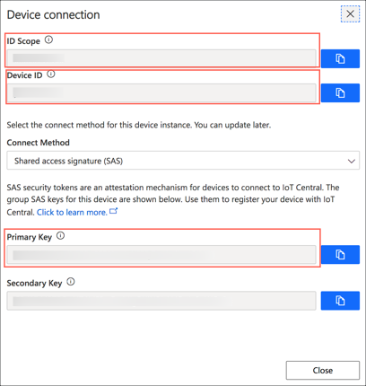
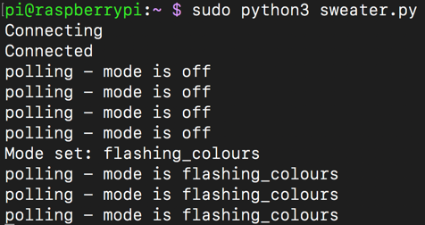
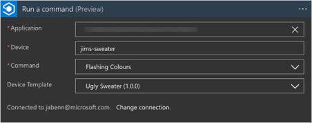

# IoT Ugly Sweater

It's holiday season, and that time of year where Ugly Sweaters become the top fashion item. And the only thing better than an ugly sweater, is an IoT ugly sweater. As seen on the [IoT Show](https://youtu.be/KiG7kR95hIQ) on [Channel9](https://channel9.msdn.com/Shows/Internet-of-Things-Show/?WT.mc_id=iotuglysweater-github-jabenn)!

**Watch the show [here](https://youtu.be/KiG7kR95hIQ)**

[](https://youtu.be/KiG7kR95hIQ "The IoT Show")

This repo has all the instructions on how to build and power your own IoT ugly sweater using low priced hardware and the power of the cloud. The sweater will light up, with the lights controlled via the cloud - either from an online dashboard or by sending a tweet!

You can find the full code for this project in the [code](https://github.com/jimbobbennett/IoTUglySweater/tree/master/code) folder.

## What you need

To build one of these sweaters, you will need the following hardware.

* A [Raspberry Pi Zero W*](https://amzn.to/35TXl13) with case, pins and SD card. These come without pins soldered on, so you will also need a soldering iron or will need to buy one with the pins pre-soldered. These boards only have micro-usb and mini-hdmi, so you will need adapters. I recommend a kit such as [this one*](https://amzn.to/35TXl13) as this includes pre-soldered headers and all the adapters.
* [AdaFruit NeoPixel strands](https://www.adafruit.com/product/3630)
* [A 4 x AA battery holder*](https://amzn.to/2Rj5mc9)
* [4 Rechargeable AA batteries*](https://amzn.to/35Wcmzs) - NOTE rechargeable batteries are a must as these run at a slightly lower voltage than non-rechargeables
* An ugly sweater - such as one of [these*](https://amzn.to/35PygV4)
* [Breadboard Jumper wires*](https://amzn.to/2RjovdE)

(**starred links are affiliate links*)

This build requires a small amount of programming in Python. It will use [IoT Central](https://azure.microsoft.com/services/iot-central/?WT.mc_id=iotuglysweater-github-jabenn) to connect to the cloud and allow your sweater to be controlled over the internet.

> If you want to read more on IoT Central, check out the [documentation](https://docs.microsoft.com/azure/iot-central/?WT.mc_id=iotuglysweater-github-jabenn).
>
> For hands-on learning, check out the IoT Central modules on [Microsoft Learn](https://docs.microsoft.com/learn/browse/?roles=administrator%2Cdeveloper&products=azure-iot-central&WT.mc_id=iotuglysweater-github-jabenn).

## The build

### Setting up the Raspberry Pi

> Some of these steps may take time to run, so you may want to jump back and forth between this section and the next to save time.

1. If you have a Raspberry Pi without the header pins soldered on, you will need to solder these on first.

1. You will need to instal Raspbian Lite on the SD card for your Pi. Follow the [instructions here](https://www.raspberrypi.org/documentation/installation/installing-images/README.md) to do this.

1. Leave the SD card plugged into your computer and browse to it - the volume should be called `boot`. If you don't see this volume, then it may not have been re-mounted after burning the image, so unplug it and plug it back in again.

1. You will need to create a couple of files on it to connect to your WiFi and allow you to SSH into the board to write the software.
    1. Create a new file in the root of the SD card called `wpa_supplicant.conf`. This file contains the WiFi connection details. Add the following to this file:

        ```sh
        ctrl_interface=DIR=/var/run/wpa_supplicant GROUP=netdev
        update_config=1
        country=US

        network={
            ssid="YOURSSID"
            psk="YOURPASSWORD"
            scan_ssid=1
        }
        ```

        Replace `YOURSSID` and `YOURPASSWORD` with the SSID and password of your WiFi.

    2. Create another new file in the root of the SD card called `ssh`. This file can remain empty, just by having the file there will allow you to SSH into the board.

1. Eject the SD card and insert it into your Raspberry Pi.

1. Power up the Pi. It should only take a few seconds to boot, and whilst this is happening you will see the LED by the power socket flash.

1. Test the connection by SSHing into your Pi. From your computer connect to `pi@raspberrypi.local`.

    ```sh
    ssh pi@raspberrypi.local
    ```

    If the host cannot be found then if you know the IP address (for example by using your routers management software) then you can log in to `pi@192.168.0.1`, replacing `192.168.0.1` with the IP address of your Pi. You can also use the [Adafruit Pi Finder utility](https://learn.adafruit.com/the-adafruit-raspberry-pi-finder/finding-and-connecting) to locate it's IP address.

    The default password is `raspberry`.

1. Install Python3. This code requires Python3, and this is not installed by default with Raspbian lite. Run the following commands to update your Pi:

    ```sh
    sudo apt-get update
    sudo apt-get upgrade
    ```

    Then run this command to install Python 3:

    ```sh
    sudo apt-get install python3-pip
    ```

### Building the sweater

Fit the Neopixel strands to your sweater. These are large and quite bright, so to be more subtle they can be sewn to the inside of the sweater and glow through, assuming the sweater is thing enough. For a chunky knit sweater you can loop these through the knit with the LEDs on the outside, and wiring on the inside.

Ensure the male connector (the one with the three pins) is near the bottom of the sweater.


### Wiring the Pi to the sweater and to power

Neopixel strands take more power than can be provided by the Pi directly (although a Pi can provide enough power for 3 or so pixels for testing), so they need an additional power source. They run off 5v, so can be powered by AA batteries. You need 4 rechargeable batteries - rechargeables only provide 1.2v, not the 1.5v of a non-rechargeable, so 4 x 1.2v = 4.8v, enough to power the whole strand.

1. Connect the negative (black) lead from the batter pack to 2 jumper wires. Do this by soldering a pin to the end of the wire from the battery box, removing the plastic covering around the male end of a female-to-male jumper lead and pushing the pin into the wire end of the jumper. This gives a male end, with the battery lead connected which can then plug into a female-to-female jumper lead. This gives 2 female connections available from the negative wire.

    

1. Solder the positive (red) lead to a pin and connected to a female-to-female jumper lead.

    

1. The positive connection needs to be connected to the positive input on the Neopixel strands. The male end of this has 3 pins - the outside ones are power, the inside one is the control pin. If you look at the 3 wires connected to the plug, one will have a red line along it. This is the positive wire and needs to be connected to the positive wire from the battery pack. The negative side connects to one of the negative jumpers.

    

1. The other negative power connection needs to connect to the ground pin on the Pi. If the Pi is positioned with the SD card at the top, the ground pin is the third pin down on the right-hand line of pins.

    

1. Finally connected the data pin on the Neopixel strand (the center pin), to the GPIO pin 18 on the Pi. If the Pi is positioned with the SD card at the top, the GPIO pin 18 is the sixth pin down on the right-hand line of pins.

    

## Controlling the NeoPixels

The first step is to write a small Python program to control the Neopixels to show they are working. There are some Python libraries you need to install first to provide control of Neopixels. All the code for this will be using Python 3.

### Write the code

1. Install the RPI.GPIO package:

    ```sh
    sudo pip3 install RPI.GPIO
    ```

1. Install the Adafruit pip packages:

    ```sh
    sudo pip3 install rpi_ws281x
    sudo pip3 install adafruit-circuitpython-neopixel
    ```

1. Create a new Python file called `sweater.py` and open it in **nano**

    ```sh
    nano sweater.py
    ```

1. Add the following code:

    ```python
    import board, neopixel

    # Define a Neopixel strand of 20 pixels in length connected to GPIO pin 18
    pixels = neopixel.NeoPixel(board.D18, 20)

    # Set the first pixel to Red (255 for Red, 0 for Green, 0 for blue)
    pixels[0] = (255, 0, 0)
    ```

1. Close nano, saving the file by using `ctrl+X` and selecting `Y` to save the modified buffer, using the same file name.

1. Run the code:

    ```sh
    sudo python3 sweater.py
    ```

    You should see the first pixel light up red.

    

    > This code needs to be run using `sudo` as the hardware access needed by the pixels needs to run with elevated privileges.

### What this code does

```python
import board, neopixel
```

This code imports the GPIO board module to access the pins, and the neopixel module needed to control the pixels.

```python
pixels = neopixel.NeoPixel(board.D18, 20)
```

This code declares a set of Neopixels 20 pixels long controlled by pin GPIO 18.

```python
pixels[0] = (255, 0, 0)
```

This code sets the first pixel (index 0) to red. The colours are set by providing the red, green and blue values from 0 to 255.

## Configuring IoT Central

IoT central is a software as a service platform for IoT, allowing you to ingest data and send commands to IoT devices with little or no code. It also has a generous free tier meaning you can run up to 5 IoT devices without paying a penny.

You can use a 7 day free trial for up to 5 devices without signing up for an Azure account (Azure is the Microsoft cloud service that powers IoT central), or use an Azure account for any number of devices.

### Signing up for an Azure account

If you want to wear your sweater for more than 7 days then you will need an Azure subscription.

* Students can sign up at [aka.ms/FreeStudentAzure](https://azure.microsoft.com/free/students/?WT.mc_id=iotuglysweater-github-jabenn) using a valid higher education email address. You won't need a credit card and will get US$100 to use for 12 months, as well as 12 months of free services. After 12 months if you are still a student you can renew for another 12 months and get another $100 and free services, and so on each year you are still a student.

* If you are not a student you can sign up at [aka.ms/FreeAz](https://azure.microsoft.com/free/?WT.mc_id=iotuglysweater-github-jabenn). You will need a credit card to verify you are not a bot (you won't be charged anything), and wil get US$200 for 30 days, as well as 12 months of free services.

### Create an IoT central application

1. Head to [AzureIoTCentral.com](https://azure.microsoft.com/services/iot-central/?WT.mc_id=iotuglysweater-github-jabenn)

1. Select **Build a solution**

    

1. From the menu on the side, select **Build**, then select **Custom app**.

    

1. Log in with a Microsoft account. If you don't have one, you can create one from the login page.

1. Fill in the application details.
    1. Give you application a name such as `IoT Ugly Sweater`.

    1. Enter a unique URL - this will become the internet end point for your app so needs to be unique. Use something like `iot-ugly-sweater-<name>-<date>` substituting `<name>` for your name and `<date>` for the current date. This also needs to be in lowercase.

    1. Set the **Application template** to be *Preview application*

1. Select either a free trial or your Azure account.

    * If you select the 7 day trial enter your contact details. The phone number is used for verification only.

    * If you want to use your Azure account select the directory, subscription and the location nearest to you.

1. Select **Create**.


### Create a device template

IoT central defines templates for each kind of device that will be configured to connect to it. These templates define an interface for how IoT central can talk to the device, and this interface includes properties that can be set on the device, commands that can be sent to it, and telemetry received from the device. For this sweater we want to allow commands to be sent to the device to control the Neopixels.

1. From the left-hand menu, select **Device templates**, then select **+ New**.

    

1. Select **IoT device** from the **Create a custom device template** section. Then select **Customize**.

    

1. Skip the next step by selecting **Next: Review**

1. Select **Create**

1. Type in the device name, such as `Ugly Sweater`, then press return.

    

1. Select the **Custom** capability model

    

### Define the template interface

Each template has an interface that defines its capabilities - the properties that can be set or commands that can be sent. For the ugly sweater we need to define an interface that has commands for all the different light patterns we want to have displayed using the Neopixels.

1. From the device template, select **+ Add interface**

    

1. Select **Custom**

    

1. Select **Add capability**. Set the **Capability type** to *Command*. This will be the first command to control your sweater, so think of what you want the lights to do and name this appropriately. For example, if you want the lights flashing random colours set the **Display name** to be `Flashing Colours` and the **Name** to be `flashing_colours` (the name needs to be a single word, without spaces). Leave the rest of the fields with their default values.

    

    Repeat this for all the different light patterns you want your sweater to have, including one called `off` to turn the lights off.

1. When you have created all your commands, select **Save**

    

1. Interfaces have to be published before you can use them with a device. Select the **Publish** button. Then select **Publish**.

    

### Create a device

Once the template has been created, it can be applied to one or more devices to allow you to control them.

1. Head to the devices tab on the left-hand menu. Select the *Ugly Sweater* device template from the templates list, and select **+ New**

    

1. Set the **Device ID** and **Device name** for your sweater. The **Device ID** cannot have spaces as this is used in the connection details. Then select **Create**. This will create a device associated with the *Ugly sweater* template.

    

1. Select the **Connect** button on the top left of the **Devices** tab. Note the **ID Scope**, **Device ID** and **Primary Key**, as you will use these later.

    

    

## Controlling the sweater from IoT Central

The next step is to write the software to control the Neopixels via IoT Central.

### Write the code

There is an Azure IoT Python SDK that can talk to IoT Central and receive these commands.

1. Install the azure-iot-device Pip package

    ```sh
    sudo pip3 install azure-iot-device
    ```

1. Install the dotenv Pip package to allow environment files to be used to store the IoT central connection string.

    ```sh
    sudo pip3 install python-dotenv
    ```

1. Create a new file called `.env`. This will be used to store the IoT central connection string. These files are special files that can be read and used to set environment variables so that secrets like connection strings don't need to be stored in source code. These files can then be ignored instead of being checked into source code control to keep your secrets safe.

    ```sh
    nano .env
    ```

1. Add the following to this file:

    ```sh
    ID_SCOPE=<your id scope>
    DEVICE_ID=<your device id>
    PRIMARY_KEY=<your primary key>
    ```

    Replace `<your id scope>` with the value of the ID Scope from the connection dialog in IoT Central. Replace `<your device id>` with the device id, and `<your primary key>` with your primary key.

1. Open the `sweater.py` file in nano

    ```sh
    nano sweater.py
    ```

1. Delete the existing code

1. Add the following code to this file

    ```python
    import board, neopixel
    import os, asyncio, threading, random
    from dotenv import load_dotenv
    from azure.iot.device.aio import IoTHubDeviceClient, ProvisioningDeviceClient
    from azure.iot.device import MethodResponse

    load_dotenv()

    pixel_count = 20
    pixels = neopixel.NeoPixel(board.D18, pixel_count)

    mode = 'off'

    id_scope = os.getenv('ID_SCOPE')
    device_id = os.getenv('DEVICE_ID')
    primary_key = os.getenv('PRIMARY_KEY')

    async def main():
        # provision the device
        async def register_device():
            provisioning_device_client = ProvisioningDeviceClient.create_from_symmetric_key(
                provisioning_host='global.azure-devices-provisioning.net',
                registration_id=device_id,
                id_scope=id_scope,
                symmetric_key=primary_key,
            )

            return await provisioning_device_client.register()

        results = await asyncio.gather(register_device())
        registration_result = results[0]

        # build the connection string
        conn_str='HostName=' + registration_result.registration_state.assigned_hub + \
                 ';DeviceId=' + device_id + \
                 ';SharedAccessKey=' + primary_key

        # The client object is used to interact with your Azure IoT Central.
        device_client = IoTHubDeviceClient.create_from_connection_string(conn_str)

        # connect the client.
        print('Connecting')
        await device_client.connect()
        print('Connected')

        # listen for commands
        async def command_listener(device_client):
            global mode
            while True:
                method_request = await device_client.receive_method_request()
                mode = method_request.name
                print('Mode set:', mode)
                payload = {'result': True, 'data': mode}
                method_response = MethodResponse.create_from_method_request(
                    method_request, 200, payload
                )
                await device_client.send_method_response(method_response)

        # async loop that controls the lights
        async def main_loop():
            global mode
            while True:
                if mode == 'flashing_colours':
                    for x in range (0, pixel_count):
                        pixels[x] = (random.randint(0, 255), random.randint(0, 255), random.randint(0, 255))
                else:
                    pixels.fill((0, 0, 0))
                await asyncio.sleep(1)

                print('polling - mode is', mode)

        listeners = asyncio.gather(command_listener(device_client))

        await main_loop()

        # Cancel listening
        listeners.cancel()

        # Finally, disconnect
        await device_client.disconnect()

    if __name__ == '__main__':
        asyncio.run(main())
    ```

    This code assumes you have created two commands, `flashing_colours` and `off`. Change the code in `main_loop` to provide different light patterns depending on the command received. This code runs every second, so use this timing to loop through the colour sequence you want.

1. Run the code

    ```sh
    sudo python3 sweater.py
    ```

    > This code needs to be run using `sudo` as the hardware access needed by the pixels needs to run with elevated privileges.

1. Head to IoT Central, select **Devices** from the left-hand menu, then select your device from the list on the right.

1. Select the **Run** button for a command. You should see this command listed in the output from the running app, and the lights should start to change colour.

    

### What this code does

```python
import board, neopixel
import os, asyncio, threading, random
from dotenv import load_dotenv
from azure.iot.device.aio import IoTHubDeviceClient, ProvisioningDeviceClient
from azure.iot.device import MethodResponse
```

This code imports the modules to control the Neopixels, talk to IoT Central, load `.env` files and use some system modules.

```python
load_dotenv()
```

This loads the environment variables from the `.env` file.

```python
pixel_count = 20
pixels = neopixel.NeoPixel(board.D18, pixel_count)
```

This declares a string of 20 Neopixels connected to the GPIO 18 pin.

```python
mode = 'off'
```

This defaults the mode to `off`, so the Neopixels start off turned off.

```python
id_scope = os.getenv('ID_SCOPE')
device_id = os.getenv('DEVICE_ID')
primary_key = os.getenv('PRIMARY_KEY')
```

This loads the ID Scope, Device ID and Primary Key from the `.env` files. These values should be kept secret and not stored in source code.

```python
async def main():
    ...

if __name__ == '__main__':
    asyncio.run(main())
```

This declares and runs an asynchronous `main` function.

```python
# provision the device
async def register_device():
    provisioning_device_client = ProvisioningDeviceClient.create_from_symmetric_key(
        provisioning_host='global.azure-devices-provisioning.net',
        registration_id=device_id,
        id_scope=id_scope,
        symmetric_key=primary_key,
    )

    return await provisioning_device_client.register()

results = await asyncio.gather(register_device())
registration_result = results[0]
```

This code uses the Azure IoT Device Provisioning Service to provision the device using the Scope ID, Device ID and Primary Key. It returns a registration result that contains information about the IoT Central instance that can be used by the device to connect.

```python
# build the connection string
conn_str='HostName=' + registration_result.registration_state.assigned_hub + \
            ';DeviceId=' + device_id + \
            ';SharedAccessKey=' + primary_key
```

Once the device has been provisioned, the result is used to build a connection string that will be used to connect to IoT Central.

```python
# The client object is used to interact with your Azure IoT Central.
device_client = IoTHubDeviceClient.create_from_connection_string(conn_str)

# connect the client
print('Connecting')
await device_client.connect()
print('Connected')
```

This code connects to IoT Central.

```python
# listen for commands
async def command_listener(device_client):
    global mode
    while True:
        method_request = await device_client.receive_method_request()
        mode = method_request.name
        print('Mode set:', mode)
        payload = {'result': True, 'data': mode}
        method_response = MethodResponse.create_from_method_request(
            method_request, 200, payload
        )
        await device_client.send_method_response(method_response)
```

This asynchronous function listens for method requests from IoT Central - these are the underlying mechanism by which commands are sent. When a method is received, the name is extracted and this is the **name** of the command. This name is stored in the `mode`, and an acknowledgement is sent back to IoT Central.

```python
# async loop that controls the lights
async def main_loop():
    global mode
    while True:
        if mode == 'flashing_colours':
            for x in range (0, pixel_count):
                pixels[x] = (random.randint(0, 255), random.randint(0, 255), random.randint(0, 255))
        else:
            pixels.fill((0, 0, 0))
        await asyncio.sleep(1)

        print('polling - mode is', mode)
```

This is an infinite loop that checks the `mode` and updates the lights based off the `mode`. If the mode is `flashing_colours`, then the lights are set to random colours, otherwise the lights are turned off. This method then sleeps for 1 second and checks again. This is where you can add other modes for different commands.

```python
listeners = asyncio.gather(command_listener(device_client))
await main_loop()
```

This code starts the listeners and the main loop.

```python
# Cancel listening
listeners.cancel()

# Finally, disconnect
await device_client.disconnect()
```

Once the main loop exits this code ends the listener and disconnects from IoT Central.

## Starting the code on boot

Ideally we want the software for the sweater running as soon as the Pi boots up. This saves having to log in and run the Python file each time the device is turned on. The easiest way to do this is via a `cron` job that is run on reboot.

1. Edit the crontab:

    ```sh
    sudo crontab -e
    ```

    If you are asked to select and editor, select `nano`.

1. Add the following line to the end of the file:

    ```sh
    @reboot /usr/bin/python3 /home/pi/sweater.py
    ```

1. Save the file and close nano.

Next time the Pi reboots it will launch the Python file and allow you to control the Neopixels.

## Controlling the sweater from Twitter

As well as providing a low barrier to entry way to build your IoT apps, IoT Central is also controllable via logic apps. These are no-code apps that can be triggered by all manner of different things and run applications built using drag and drop programming.

Logic apps are slightly outside the scope of this post, so the best place to start is the [Introduction to Azure Logic Apps learning path on Microsoft Learn](https://docs.microsoft.com/learn/modules/intro-to-logic-apps/?WT.mc_id=iotuglysweater-github-jabenn).

One of the available connections is for IoT Central. You can add triggers or actions that interact with your IoT Central application. Once you add an action or a trigger, there will be an option to sign in.

1. Create a trigger of your choice - for example the **When a new tweet is posted** trigger. Log into Twitter when prompted, and configure this how you want.

1. Add an action to trigger a command, such as the `flashing_colours` command. To create this, add a **Run a command** action.

1. Select the **Sign in** button and sign in to IoT Central.

1. At the moment, applications are not populated correctly to the **Application** field, so you will need to set a custom value. You can get the application id from IoT Central, from the **Administration** menu item in the **Application settings** section.

    

1. Once the application id is set, the **Device template** list should populate, so select the *Ugly sweater* device template.

1. Once the device template is set, the **Command** list will populate, so select teh *Flashing Colours* command.

1. Set the **Device** to be the id of your device.

    

1. Save the logic app.

1. Send a tweet matching the criteria in the action, and your sweater should respond.

## Learn more

If you want to read more on IoT Central, check out the [documentation](https://docs.microsoft.com/azure/iot-central/?WT.mc_id=iotuglysweater-github-jabenn).

For hands-on learning, check out the IoT Central modules on [Microsoft Learn](https://docs.microsoft.com/learn/browse/?roles=administrator%2Cdeveloper&products=azure-iot-central&WT.mc_id=iotuglysweater-github-jabenn).
