# IoT Ugly Sweater

It's holiday season, and that time of year where Ugly Sweaters become the top fashion item. And the only thing better than an ugly sweater, is an IoT ugly sweater. As seen on the [IoT Show](https://youtu.be/KiG7kR95hIQ) on [Channel9](https://channel9.msdn.com/Shows/Internet-of-Things-Show/?WT.mc_id=iotuglysweater-github-jabenn)!

**Watch the show [here](https://youtu.be/KiG7kR95hIQ)**

[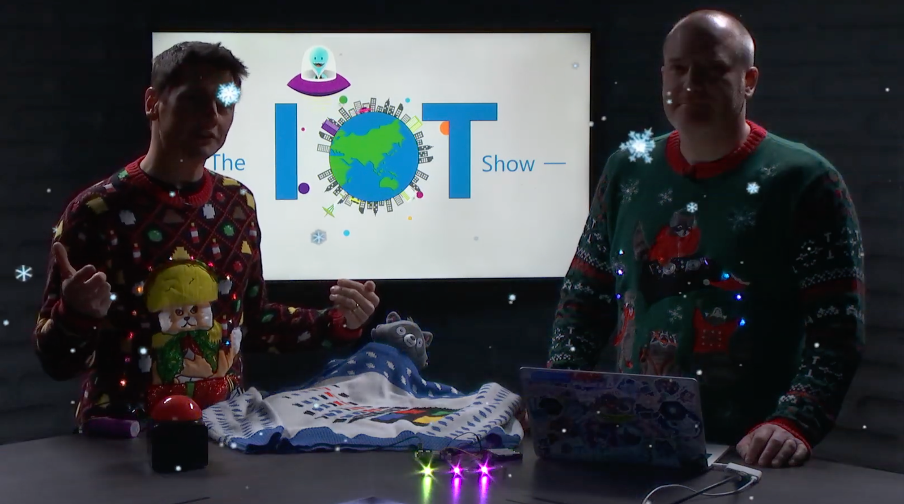](https://youtu.be/KiG7kR95hIQ "The IoT Show")

This repo has all the instructions on how to build and power your own IoT ugly sweater using low priced hardware and the power of the cloud. The sweater will light up, with the lights controlled via the cloud - either from an online dashboard or by sending a tweet!

## What you need

To build one of these sweaters, you will need the following hardware.

* A [Raspberry Pi Zero W*](https://amzn.to/35TXl13) with case, pins and SD card. These come without pins soldered on, so you will also need a soldering iron or will need to buy one with the pins pre-soldered. These boards only have micro-usb and mini-hdmi, so you will need adapters. I recommend a kit such as [this one*](https://amzn.to/35TXl13) as this includes pre-soldered headers and all the adapters.
* [AdaFruit NeoPixel strands](https://www.adafruit.com/product/3630)
* [A 4 x AA battery holder*](https://amzn.to/2Rj5mc9)
* [4 Rechargeable AA batteries*](https://amzn.to/35Wcmzs) - NOTE rechargeable batteries are a must as these run at a slightly lower voltage than non-rechargeables
* An ugly sweater - such as one of [these*](https://amzn.to/35PygV4)
* [Breadboard Jumper wires*](https://amzn.to/2RjovdE)

(**starred links are affiliate links*)

This build requires a small amount of programming in Python. It will use [IoT Central](https://azure.microsoft.com/services/iot-central/?WT.mc_id=iotuglysweater-github-jabenn) to connect to the cloud and allow your sweater to be controlled over the internet.

> If you want to read more on IoT Central, check out the [documentation](https://docs.microsoft.com/azure/iot-central/?WT.mc_id=iotuglysweater-github-jabenn).
>
> For hands-on learning, check out the IoT Central modules on [Microsoft Learn](https://docs.microsoft.com/learn/browse/?roles=administrator%2Cdeveloper&products=azure-iot-central&WT.mc_id=iotuglysweater-github-jabenn).

## The build

### Setting up the Raspberry Pi

> Some of these steps may take time to run, so you may want to jump back and forth between this section and the next to save time.

1. If you have a Raspberry Pi without the header pins soldered on, you will need to solder these on first.

1. You will need to instal Raspbian Lite on the SD card for your Pi. Follow the [instructions here](https://www.raspberrypi.org/documentation/installation/installing-images/README.md) to do this.

1. Leave the SD card plugged into your computer and browse to it - the volume should be called `boot`. If you don't see this volume, then it may not have been re-mounted after burning the image, so unplug it and plug it back in again.

1. You will need to create a couple of files on it to connect to your WiFi and allow you to SSH into the board to write the software.
    1. Create a new file in the root of the SD card called `wpa_supplicant.conf`. This file contains the WiFi connection details. Add the following to this file:

        ```sh
        ctrl_interface=DIR=/var/run/wpa_supplicant GROUP=netdev
        update_config=1
        country=US

        network={
            ssid="YOURSSID"
            psk="YOURPASSWORD"
            scan_ssid=1
        }
        ```

        Replace `YOURSSID` and `YOURPASSWORD` with the SSID and password of your WiFi.

    2. Create another new file in the root of the SD card called `ssh`. This file can remain empty, just by having the file there will allow you to SSH into the board.

1. Eject the SD card and insert it into your Raspberry Pi.

1. Power up the Pi. It should only take a few seconds to boot, and whilst this is happening you will see the LED by the power socket flash.

1. Test the connection by SSHing into your Pi. From your computer connect to `pi@raspberrypi.local`.

    ```sh
    ssh pi@raspberrypi.local
    ```

    If the host cannot be found then if you know the IP address (for example by using your routers management software) then you can log in to `pi@192.168.0.1`, replacing `192.168.0.1` with the IP address of your Pi. You can also use the [Adafruit Pi Finder utility](https://learn.adafruit.com/the-adafruit-raspberry-pi-finder/finding-and-connecting) to locate it's IP address.

    The default password is `raspberry`.

1. Install Python3. This code requires Python3, and this is not installed by default with Raspbian lite. Run the following commands to update your Pi:

    ```sh
    sudo apt-get update
    sudo apt-get upgrade
    ```

    Then run this command to install Python 3:

    ```sh
    sudo apt-get install python3-pip
    ```

### Building the sweater

Fit the Neopixel strands to your sweater. These are large and quite bright, so to be more subtle they can be sewn to the inside of the sweater and glow through, assuming the sweater is thing enough. For a chunky knit sweater you can loop these through the knit with the LEDs on the outside, and wiring on the inside.

Ensure the male connector (the one with the three pins) is near the bottom of the sweater.

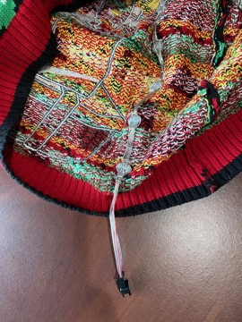

### Wiring the Pi to the sweater and to power

Neopixel strands take more power than can be provided by the Pi directly (although a Pi can provide enough power for 3 or so pixels for testing), so they need an additional power source. They run off 5v, so can be powered by AA batteries. You need 4 rechargeable batteries - rechargeables only provide 1.2v, not the 1.5v of a non-rechargeable, so 4 x 1.2v = 4.8v, enough to power the whole strand.

1. Connect the negative (black) lead from the batter pack to 2 jumper wires. Do this by soldering a pin to the end of the wire from the battery box, removing the plastic covering around the male end of a female-to-male jumper lead and pushing the pin into the wire end of the jumper. This gives a male end, with the battery lead connected which can then plug into a female-to-female jumper lead. This gives 2 female connections available from the negative wire.

    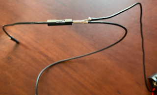

1. Solder the positive (red) lead to a pin and connected to a female-to-female jumper lead.

    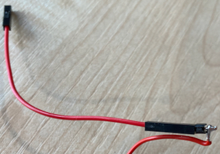

1. The positive connection needs to be connected to the positive input on the Neopixel strands. The male end of this has 3 pins - the outside ones are power, the inside one is the control pin. If you look at the 3 wires connected to the plug, one will have a red line along it. This is the positive wire and needs to be connected to the positive wire from the battery pack. The negative side connects to one of the negative jumpers.

    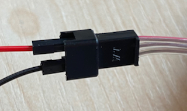

1. The other negative power connection needs to connect to the ground pin on the Pi. If the Pi is positioned with the SD card at the top, the ground pin is the third pin down on the right-hand line of pins.

    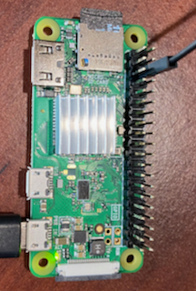

1. Finally connected the data pin on the Neopixel strand (the center pin), to the GPIO pin 18 on the Pi. If the Pi is positioned with the SD card at the top, the GPIO pin 18 is the sixth pin down on the right-hand line of pins.

    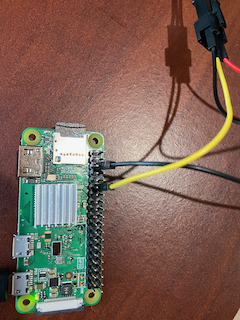

## Controlling the NeoPixels

The first step is to write a small Python program to control the Neopixels to show they are working. There are some Python libraries you need to install first to provide control of Neopixels. All the code for this will be using Python 3.

1. Install the [RPI.GPIO](https://pypi.org/project/RPi.GPIO/) package:

    ```sh
    sudo pip3 install RPI.GPIO
    ```

1. Install the Adafruit pip packages:

    ```sh
    sudo pip3 install rpi_ws281x
    sudo pip3 install adafruit-circuitpython-neopixel
    ```

1. Create a new Python file called `sweater.py` and open it in **nano**

    ```sh
    nano sweater.py
    ```

1. Add the following code:

    ```python
    import board
    import neopixel

    # Define a Neopixel strand of 20 pixels in length connected to GPIO pin 18
    pixels = neopixel.NeoPixel(board.D18, 20)

    # Set the first pixel to Red (255 for Red, 0 for Green, 0 for blue)
    pixels[0] = (255, 0, 0)
    ```

1. Close nano, saving the file by using `ctrl+X` and selecting `Y` to save the modified buffer, using the same file name.

1. Run the code:

    ```sh
    sudo python3 sweater.py
    ```

    You should see the first pixel light up red.

    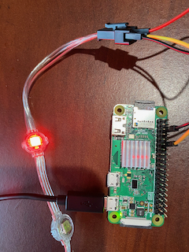

    > This code needs to be run using `sudo` as the hardware access needed by the pixels needs to run with elevated privileges.

## Configuring IoT Central

IoT central is a software as a service platform for IoT, allowing you to ingest data and send commands to IoT devices with little or no code. It also has a generous free tier meaning you can run up to 5 IoT devices without paying a penny.

You can use a 7 day free trial for up to 5 devices without signing up for an Azure account (Azure is the Microsoft cloud service that powers IoT central), or use an Azure account for any number of devices.

### Signing up for an Azure account

If you want to wear your sweater for more than 7 days then you will need an Azure subscription.

* Students can sign up at [aka.ms/FreeStudentAzure](https://azure.microsoft.com/free/students/?WT.mc_id=iotuglysweater-github-jabenn) using a valid higher education email address. You won't need a credit card and will get US$100 to use for 12 months, as well as 12 months of free services. After 12 months if you are still a student you can renew for another 12 months and get another $100 and free services, and so on each year you are still a student.

* If you are not a student you can sign up at [aka.ms/FreeAz](https://azure.microsoft.com/free/?WT.mc_id=iotuglysweater-github-jabenn). You will need a credit card to verify you are not a bot (you won't be charged anything), and wil get US$200 for 30 days, as well as 12 months of free services.

### Create an IoT central application

1. Head to [AzureIoTCentral.com](https://azure.microsoft.com/services/iot-central/?WT.mc_id=iotuglysweater-github-jabenn)

1. Select **Build a solution**

    

1. From the menu on the side, select **Build**, then select **Custom app**.

    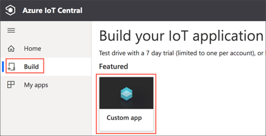

1. Log in with a Microsoft account. If you don't have one, you can create one from the login page.

1. Fill in the application details.
    1. Give you application a name such as `IoT Ugly Sweater`.

    1. Enter a unique URL - this will become the internet end point for your app so needs to be unique. Use something like `iot-ugly-sweater-<name>-<date>` substituting `<name>` for your name and `<date>` for the current date. This also needs to be in lowercase.

    1. Set the **Application template** to be *Preview application*

1. Select either a free trial or your Azure account.

    * If you select the 7 day trial enter your contact details. The phone number is used for verification only.

    * If you want to use your Azure account select the directory, subscription and the location nearest to you.

1. Select **Create**.


### Create a device template

IoT central defines templates for each kind of device that will be configured to connect to it. These templates define an interface for how IoT central can talk to the device, and this interface includes properties that can be set on the device, commands that can be sent to it, and telemetry received from the device. For this sweater we want to allow commands to be sent to the device to control the Neopixels.

1. From the left-hand menu, select **Device templates**, then click **+ New**.

    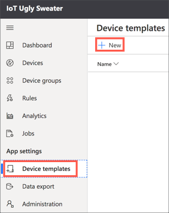

1. Select **IoT device** from the **Create a custom device template** section. Then click **Customize**.

    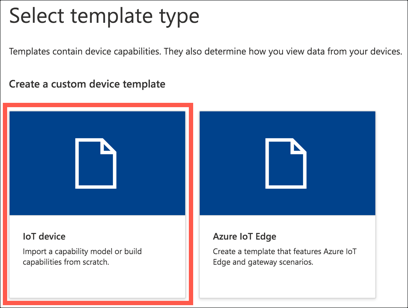

1. Skip the next step by selecting **Next: Review**

1. Select **Create**

1. Type in the device name, such as `Ugly Sweater`, then press return.

    

1. Select the **Custom** capability model

    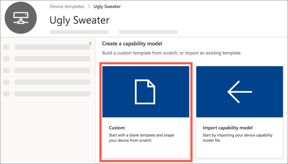

### Define the template interface

Each template has an interface that defines its capabilities - the properties that can be set or commands that can be sent. For the ugly sweater we need to define an interface that has commands for all the different light patterns we want to have displayed using the Neopixels.

1. From the device template, select **+ Add interface**

    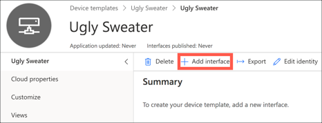

1. Select **Custom**

    

1. Select **Add capability**. Set the **Capability type** to *Command*. This will be the first command to control your sweater, so think of what you want the lights to do and name this appropriately. For example, if you want the lights flashing random colours set the **Display name** to be `Flashing Colours` and the **Name** to be `flashing_colours` (the name needs to be a single word, without spaces). Leave the rest of the fields with their default values.

    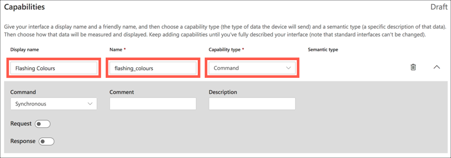

    Repeat this for all the different light patterns you want your sweater to have, including one called `off` to turn the lights off.

1. When you have created all your commands, select **Save**

    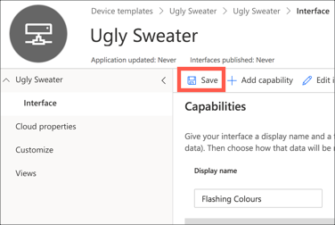

1. Interfaces have to be published before you can use them with a device. Select the **Publish** button. Then select **Publish**.

    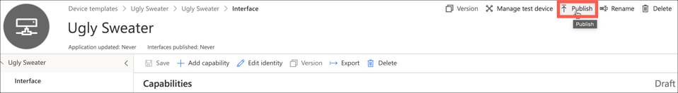

### Create a device

Once the template has been created, it can be applied to one or more devices to allow you to control them.

1. Head to the devices tab on the left-hand menu. Select the *Ugly Sweater* device template from the templates list, and select **+ New**

    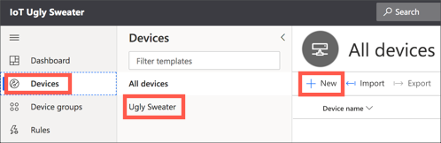

1. Set the **Device ID** and **Device name** for your sweater. The **Device ID** cannot have spaces as this is used in the connection details. Then click **Create**. This will create a device associated with the *Ugly sweater* template.

    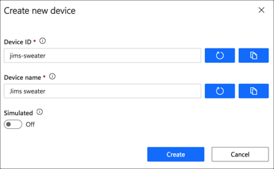

## Writing the code to control the sweater from IoT Central

## Starting the code on boot

Ideally we want the software for the sweater running as soon as the Pi boots up. This saves having to log in and run the Python file each time the device is turned on. The easiest way to do this is via a `cron` job that is run on reboot.

1. Edit the crontab:

    ```sh
    sudo crontab -e
    ```

    If you are asked to select and editor, select `nano`.

1. Add the following line to the end of the file:

    ```sh
    @reboot /usr/bin/python3 /home/pi/sweater.py
    ```

1. Save the file and close nano.

Next time the Pi reboots it will launch the Python file and allow you to control the Neopixels.

## Controlling the sweater from Twitter

## Learn more

If you want to read more on IoT Central, check out the [documentation](https://docs.microsoft.com/azure/iot-central/?WT.mc_id=iotuglysweater-github-jabenn).

For hands-on learning, check out the IoT Central modules on [Microsoft Learn](https://docs.microsoft.com/learn/browse/?roles=administrator%2Cdeveloper&products=azure-iot-central&WT.mc_id=iotuglysweater-github-jabenn).
